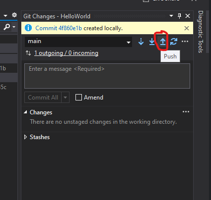

# Introduktionsövning Deadline 23/8-2021 09:00

1. Öppna [GitHub](https://www.github.com) och logga in med ditt nya konto.
2. Skapa ett nytt repository enligt [denna](./newRepo.md) beskrivningen.
3. Tryck på **"Code"** och välj **"Open with GitHub Desktop"** 
   1. 
     
   2. Installera **GitHub Desktop** och logga in.   
   3. Gör samma igen så du får upp den här dialogen: 
4. Öppna **Visual Studio 2019** och välj **Create Project** 
5. Sök på **"Console"** och filtrera på **"C#"** och välj **"Console Application"**  
6. Tryck på **"Next"**
7.  I nästa dialog sätt ett **"Project name"** och säkerställ att det hamnar på rätt ställe som bilden visar  
8.  Tryck på **"Next"**
9.  I nästa dialog välj .Net Core 5.0 och tryck på **"Create"**
10. Du bör nu ha ett projekt som ser ut såhär:  
11. Oroa dig inte om du inte förstår vad allt är. Vi kommer att gå igenom vad saker är i sinom tid.
12. Du kan nu testa att köra ditt första(?) program genom att trycka på **"Run"**  
13. Nästa steg är att ändra texten **"Hello World!"** till **"Hello! My name is** *Ditt namn*.**"**.
14. Nu är det dags att påbörja inlämningnen.
15. Det finns flera vägar att ta för att pusha sitt arbete till GitHub. Jag kommer att beskriva ett sätt nu men välj ett annat du redan kan om du vill.
16. Installera GitHub Extension i Visual Studio Code:
    1.  Öppna Extension Manager:  
    2.  Sök på "**GitHub**":  
    3.  **Installera** och **starta om** Visual Studio 2019 Community
    4.  Välj **Git Changes**, fyll i ett meddelande, tryck på **Commit All**:  
    5.  Tryck på **"Push"**:  
17. Nu är ditt repository på **GitHub** uppdaterat:  
    1.  Om du inte ser din projektmapp som bilden ovan så skriv till mig på Discord.
18. Kopiera URL:en till ditt repo:  
19. Klistra in länken i inlämningen på [ITHS-Distans](https://www.ithsdistans.se/)
20. **Lämna in senast Måndag den 23/8 09:00** 