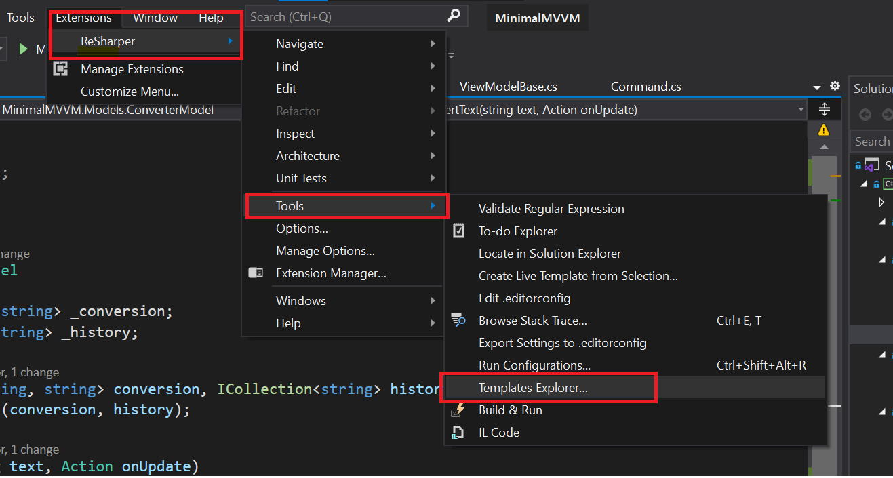
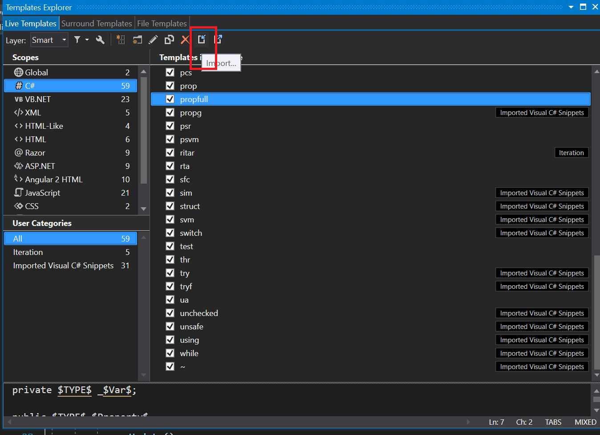

# Hur man får in propfull i ReSharper

* Hämta denna filen: [propfull.dotsettings](./propfull.DotSettings)
* Öppna Visual Studio 2022 och gå till:   **Extensions** > **ReSharper** > **Tools** > **Temmplate Explorer** som bilden:  

* Välj **C#** och tryck **Import**  

* Gå till mappen där du sparade **propfull.dotsettings** och välj den.  

* Nu kan du stänga Template Explorer

## Klart!
