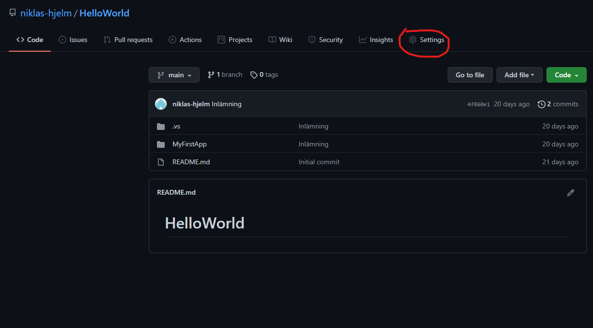
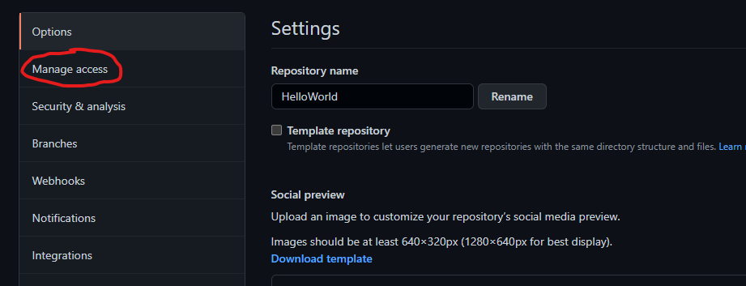
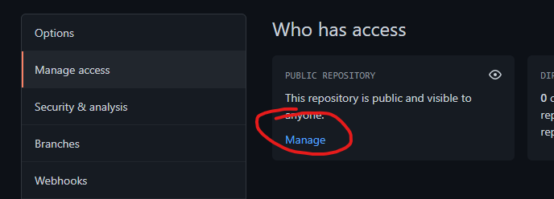
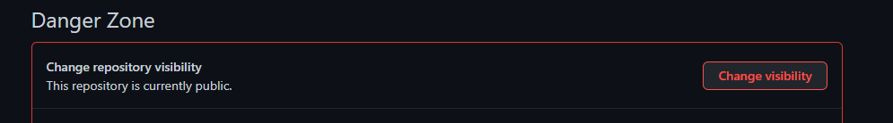
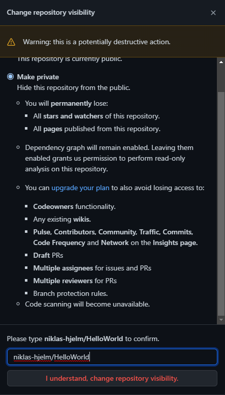
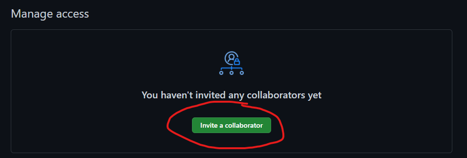

# Inställningar för privat Repo

1. Om du har ett publikt repo och behöver ändra
   1. Navigera till ditt repo på [github](https://www.github.com)
   2. Tryck på **Settings**: 
   3. Gå till **Manage Access** 
   4. Tryck på **Manage** 
   5. Välj **Change Visibility** i Danger Zone 
   6. Byt till Private 
2. För att lägga till en collaborator gå till **Manage Access**
3. Klicka på **Invite a Collaborator** 
4. Skriv in **niklas-hjelm** och bjud in mig. (Andra ifall det är andra du ska bjuda in)