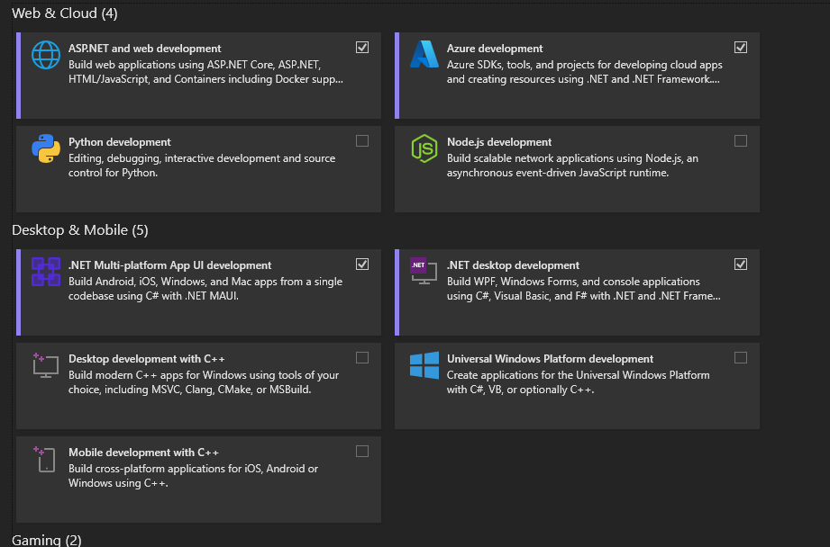

# V 33

## Onsdag (Distans)

### 09:00-11:00 Intro Programmering C#
1. Presentation av Niklas och upprop.
2. Installation av miljö och verktyg.
   * Ladda ner och installera [Visual Studio Community 2019](https://visualstudio.microsoft.com/thank-you-downloading-visual-studio/?sku=Community&rel=16).
      - I installationen välj paketen enligt .
   * Ladda ner och installera [Git](https://git-scm.com/download/win).
   * Skapa ett konto på [GitHub](https://github.com/).

### 12:30-16:00 Övning (Deadline Måndag 23/8)

För att säkerställa att samtliga har installerat allt ifrån förmiddagen så kommer ni också att få en övning där alla verktygen används. Det krävs inga kunskaper i programmering.

[Introduktionsövning](./IntroÖvning.md)
